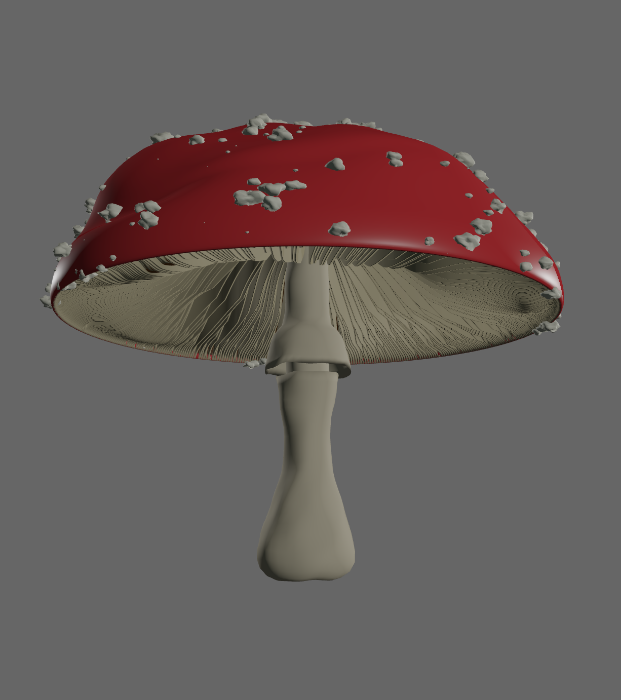
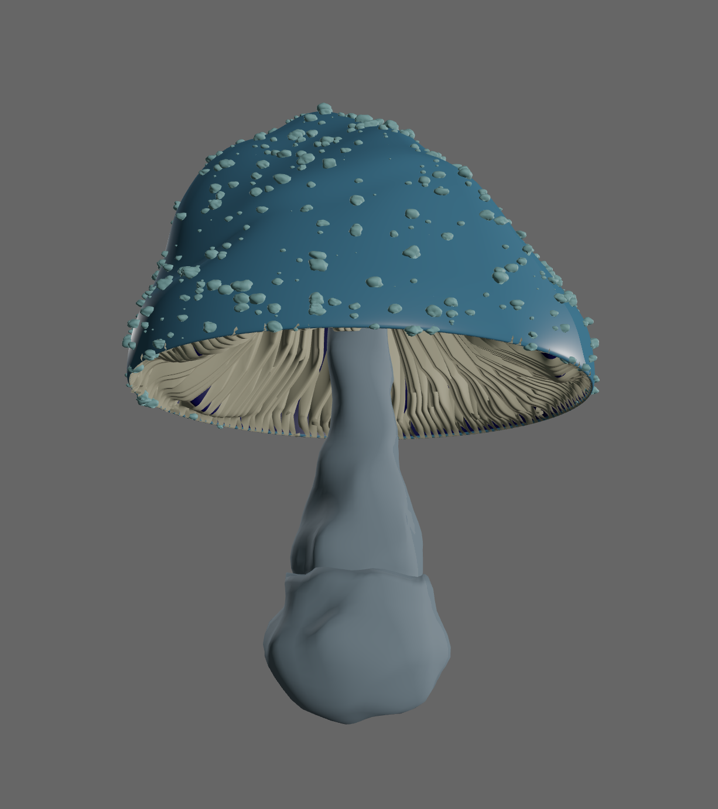
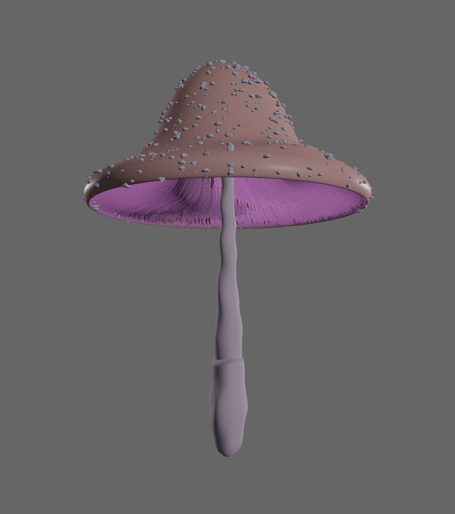
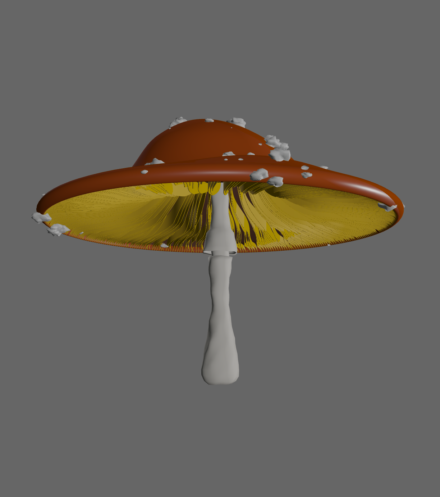

# Mushroom Generator

## Overview

This project is an interactive procedural mushroom generator developed for the ASE assignment at NCCA. The goal of the project is to explore procedural geometry generation, OpenGL rendering, and Qt-based user interaction within modular Python architecture.

The application allows users to interactively modify mushroom parameters (stem, cap, gills, and scales) via a Qt interface and immediately visualize the result in a real-time OpenGL viewport. The final mushroom can be exported as a .obj file for later use in software like Houdini or Maya. The project focuses on procedural techniques (revolve, scatter, noise) and architectural clarity.

---



---

## Architecture

The project is structured as a Python package (mushroomgen) with the following separation of concerns:
```text
mushroomGen/
│
├── main.py                     # Application entry point
├── QtMainWidget.ui             # Qt Creator UI layout
├── examples/                   # .obj meshes as examples of different mushrooms
│
├── src/mushroomgen/
│   ├── core/
│   │   ├── build.py            # High-level mushroom construction
│   │   └── species.py          # Species definitions and parameters
│   │
│   ├── generators/
│   │   ├── curves.py           # Curve generation utilities
│   │   ├── geometry.py         # Hermite and Catmull-Rom functions
│   │   └── noiseFields.py      # Noise Field generator
│   │
│   ├── render/
│   │   ├── openGl.py           # OpenGL rendering logic
│   │   ├── viewer.py           # PyVista viewer helper
│   │   ├── Gl_debug_helper.py  # OpenGl Debug utilities
│   │   └── shaders/
│   │       ├── Vertex.glsl     # PBR Vertex shader for rendering
│   │       └── Fragment.glsl   # PBR Fragment shader for rendering
│   │
│   └── __init__.py
│
└── tests/                      # Unit tests
```

This layered structure allows geometry generation, rendering, and UI logic to evolve independently.

---

## Class and Module Overview
### `MushroomType` (`core/species.py`)

**Purpose:**  
Defines a mushroom species through a collection of parameters. This design separates what a mushroom is from how it is generated, improving clarity and scalability.

**Key Features:**
- Uses a `@dataclass` for clarity and extensibility
- Stores all stem, cap, gills, and scale parameters
- Enables easy switching between species

---

### `build.py` (Core Builder)

**Purpose:**  
build.py coordinates the construction of the complete procedural mushroom mesh. It acts as the central pipeline that connects species parameters with the individual geometry generators.

**Responsibilities:**

- Generate stem mesh: Revolves a stem curve, applies noise for natural variation, and builds triangles with optional end caps.
- Generate cap mesh: Revolves a cap curve, applies noise-based displacement, and separates inner/outer faces for gills.
- Generate gills mesh: Creates inner cap curves, applies random cuts and wave noise, builds volumetric gill meshes with thickness.
- Generate scales mesh: Places small spherical scales on the cap surface, deforms them with noise, and aligns them to vertex normals.
- Combine meshes: Assembles stem, cap, gills, and scales into a single mushroom mesh with proper placement and local-to-world transformations.
- Support export: Provides OBJ export with vertices, faces, and vertex normals for use in external 3D applications. (examples of this in the `examples/` directory)
- Utility functions: Resample curves, compute stem frame, and apply cap/gill noise for realistic procedural detail.

By separating orchestration from generation and rendering, build.py keeps the system modular, testable, and easy to extend with additional procedural components.

---

### `MushroomType` (`generators/curves.py`)

**Purpose:**  
Provides reusable utilities for generating 2D profile curves used in procedural modeling.

**Responsibilities:**
- Generates profile curves for the stem and cap
- Supports different curve shapes based on species parameters
- Supplies clean, sampled input data for revolve operations

These curves form the foundation of all radially generated geometry in the project.

---

### `geometry.py`

**Purpose:**  
Provides mathematical curve generation utilities used as the foundation for procedural geometry.

**Responsibilities:**
- Implements Hermite curves for smooth interpolation between control points
- Implements Catmull–Rom splines by chaining Hermite segments
- Produces clean, sampled curve data used later by higher-level geometry builders

This module focuses exclusively on curve evaluation, keeping mathematical interpolation separate from mesh construction and rendering logic.

---

### `noiseFields.py`

**Purpose:**  
Encapsulates the configuration and evaluation of 3D simplex noise.

**Responsibilities:**
- Wraps snoise3 into a reusable, object-oriented interface
- Supports multiple octaves through frequency and amplitude accumulation
- Normalizes the output to keep noise values stable and predictable

This class centralizes noise configuration, making it easy to reuse consistent noise behavior across different procedural elements.

---



---

### `MushroomType` (`render/shaders/Vertex.glsl, Fragment.glsl`) 

**Purpose:**  
Define how 3D geometry is transformed and shaded on the GPU using physically based rendering (PBR) for realistic lighting.

**Responsibilities:**
### Vertex Shader
- Transforms vertex positions from model space to clip space for rendering.
- Transforms normals correctly for lighting.
- Passes texture coordinates and world-space position to the fragment shader.

### Fragment Shader (fragment.glsl)
- Computes final pixel color based on material properties (albedo, metallic, roughness, AO) and lights.
- Implements Cook-Torrance PBR model for realistic diffuse and specular shading.
- Adds ambient lighting and applies tone mapping and gamma correction.

Together, these shaders make objects appear realistic, with proper light reflections, shading, and depth, while keeping the rendering physically plausible and visually clear.

---

## `MushroomType` (`render/shaders/openGl.py`) 

**Purpose:**  
Handles rendering of 3D mushrooms in a Qt OpenGL widget, providing interactive viewing and real-time updates when changing mushroom parameters.

**Responsibilities:**
- Initialize OpenGL: Sets up the OpenGL context, loads shaders (Vertex.glsl & Fragment.glsl), creates buffers (VAO/VBO), computes normals, and positions the mushroom for viewing.
- Build and update mesh: Uses Build and species data to generate geometry for the mushroom, including stem, cap, gills, and scales. Supports real-time rebuilds when parameters change.
- Handle user interaction: Mouse rotation, translation, and zoom for intuitive camera control. Keyboard shortcuts (e.g., wireframe mode, reset view).
- Set up camera and projection: Computes view, projection, and model matrices to render the scene correctly.
- Render with PBR shaders: Passes material properties and light positions/colors to the shaders for realistic shading. Supports multiple submeshes (stem, cap, gills, scales) with individual colors and roughness.

---

## Procedural Techniques

### Revolve

The revolve technique generates radially symmetric geometry by rotating a 2D profile curve around an axis to produce 3D surfaces. In this project, revolve is used for both the mushroom stem and cap, allowing the creation of smooth, controllable organic forms.

```
X = x * cos(theta)
Y = x * sin(theta)
Z = y
```
- `x, y` → coordinates of the 2D profile curve  
- `theta ∈ [0, 2π]` → rotation angle  
- `Z = y` → height along the axis

**Implementation in project:**
- Stem: The 2D profile of the stem, defined with Catmull-Rom points along the vertical axis, is revolved around the z-axis to produce a 3D tubular mesh.
- Cap: The 2D outline of the cap, also defined with Catmull-Rom splines (round or cone type), is revolved to produce the 3D mushroom cap.

This technique ensures that both stem and cap maintain radial symmetry while allowing precise control over height, radius, and curvature.

### Scatter

Scatter is used to distribute points across generated surfaces to create secondary structures, such as gills under the cap and scales on the cap surface. The approach combines random selection with surface normals to ensure even, natural-looking placement.

```
p_new = p_surface + epsilon * n
```
- `p_surface` → vertex on the surface  
- `n` → normal vector at that vertex  
- `epsilon ~ U(-r, r)` → small random offset

**Implementation in project:**
- Cap scales: Outer cap vertices are selected randomly (rng.choice) as scale centers. Each scale mesh is aligned along the vertex normal and offset slightly with noise to avoid uniformity.
- Gills: Inner points of the cap are sampled using a similar scatter approach, ensuring even distribution along the underside while maintaining the natural curvature of the cap.

Mathematically, this uses discrete uniform sampling and vector addition along normals to perturb positions, simulating natural randomness while maintaining control.

### Curve Generation

Curve generation allows precise definition of stem and cap profiles using parametric splines, which are essential for creating smooth, continuous surfaces before revolving. The project uses Catmull-Rom splines, implemented with Hermite interpolation, to produce curves from control points.


```
C(t) = h00(t)*p0 + h10(t)*t0 + h01(t)*p1 + h11(t)*t1
```

Where the Hermite basis functions are:

```
h00(t) = 2t^3 - 3t^2 + 1
h10(t) = t^3 - 2t^2 + t
h01(t) = -2t^3 + 3t^2
h11(t) = t^3 - t^2
```

Tangents for Catmull-Rom are calculated as:

```
t_i = 0.5 * (p_{i+1} - p_{i-1})
```

**Implementation in project:**

- Stem curves: Defined with multiple control points to model features like rings, bulbs, and tapering, generating points along the stem axis for revolve.
- Cap curves: Outer and inner points of the cap are generated as Catmull-Rom curves, creating the profile for the final 3D cap mesh.
- Implementation: Each segment of the curve is computed using Hermite basis functions, ensuring smooth interpolation between points.

This approach allows the stem and cap to be parametrically defined, making the system flexible for different mushroom species by adjusting segment counts, radii, heights, and control points.

---



---

## OpenGL Usage

The OpenGLScene class renders procedural mushrooms in real time using modern OpenGL. It manages mesh creation, PBR shading, camera and projection setup, and interactive controls like rotation, translation, and zoom. It also allows real-time updates when mushroom parameters change and can export the mesh as an OBJ file. (examples of this in the `examples/` directory)

- **VBOs (Vertex Buffer Objects):** store vertex positions, normals, and optionally other vertex attributes.
- **VAOs (Vertex Array Objects):** encapsulate vertex attribute layout and index buffers for efficient rendering.
- **Shaders:**
  - `Vertex.glsl`: transforms vertices from model space to clip space, computes world-space positions and normals.
  - `Fragment.glsl`: implements physically based rendering (PBR) with Cook-Torrance shading, handling diffuse, specular, and ambient lighting per fragment. Supports material parameters like albedo, metallic, roughness, and ambient occlusion.

### Lighting & Shading

- The scene uses multiple point lights with configurable positions and intensities.

- Cook-Torrance PBR in the fragment shader simulates realistic reflections and highlights.

- Submeshes (stem, cap, gills, scales) have individual material properties, allowing visually distinct shading.

- Ambient and HDR tone mapping enhance depth perception and make the mushroom’s 3D form clear and natural.


### Interaction & Camera

- Mouse controls: rotate, translate, and zoom the model for flexible viewing.

- Keyboard shortcuts: toggle wireframe/fill, reset view, or exit.

- The camera and projection matrices are dynamically computed to fit the mushroom in view, adjusting automatically when the model is rebuilt.

### Impact:
This system combines modern OpenGL techniques with real-time procedural geometry and physically based lighting, producing a responsive, visually rich 3D viewport that communicates both shape and material properties effectively.

---

## Qt Creator Usage

The Qt Creator IDE was used to design and implement the user interface of the procedural mushroom generator. The main UI is defined in the QtMainWidget.ui file, which allows a visual, drag-and-drop approach to creating widgets, layouts, and controls. Using Qt Designer within Qt Creator provided a fast and intuitive workflow to set up the interface without manually coding every layout.

**Features:**
- Sliders for procedural parameters
- Buttons for regeneration and export
- Embedded OpenGL viewport
- Widget tabs for organization and navigation

Qt’s signals and slots connect UI actions (like slider changes or button clicks) to functions that update mushroom parameters, regenerate the scene, and handle tasks like exporting. This design keeps the UI responsive, modular, and decoupled from the procedural geometry and rendering logic.

---

## PyVista (Initial Visualization)

During early development, **PyVista** was used to quickly visualize generated meshes. This helped validate procedural logic and geometry structure before integrating OpenGL and Qt.

---

## Tests

The project includes unit tests located in the `tests/` directory:

- `test_build.py` – validates mushroom construction
- `test_curves.py` – tests curve generation
- `test_geometry.py` – checks hermite curves and catmul-rom logic

---



---

## Conclusions

This project successfully demonstrates procedural modeling through coding, rather than relying on pre-existing software, while providing the capability to interactively manipulate and refine the mesh. The system delivers high-quality results: the mushroom mesh is displayed and updated correctly in real time without any issues.

Throughout the development, I gained a deeper understanding of how complex 3D volumes can be built from simple curves, and how crucial it is to store mesh data in a logical, structured order to maintain stability and correctness. Working with OpenGL expanded my knowledge of graphics libraries and the intricacies of delivering 3D graphics efficiently, including shader management, buffer handling, and lighting models.

I also improved my proficiency with NumPy, which proved invaluable for handling large arrays of vertex and index data. Industry-standard techniques such as scatter and revolve were fully explored and applied, giving me insight into procedural content generation methods used in professional pipelines. Additionally, I learned about integrating noise and randomness to produce natural-looking organic forms, and how to structure code to allow easy extension and experimentation.

Overall, this project not only delivered a working interactive procedural mushroom generator, but also provided significant personal learning in procedural modeling, OpenGL rendering, UI integration, and computational geometry techniques.

### Future Improvements and Scalability

Currently, the project includes only one mushroom species, but the architecture is designed to easily scale to multiple species by simply defining new MushroomType instances. Future improvements could include refining the visual fidelity of the mushrooms, adding animations to simulate growth or environmental interactions, and incorporating additional procedural details such as more complex gills, textures, and environmental props. The system could also be extended to support real-time physics. Overall, the project provides a flexible foundation for expanding both in variety and technical complexity.

---

## References and Resources

Acerola. (2025, March 30). What is Perlin noise? [Video]. YouTube. https://www.youtube.com/watch?v=DxUY42r_6Cg

Baur, K. (2020, February 24). Procedural art: Plant generation in Houdini. 80.lv. https://80.lv/articles/006sdf-procedural-art-plant-generation-in-houdini

Botsch, M., Kobbelt, L., Pauly, M., Alliez, P., & Levy, B. (2010). Polygon mesh processing (1st ed.). A K Peters/CRC Press. https://doi.org/10.1201/b10688

Cen, C., & Zhou, J. (2021). Cubic α-Catmull–Rom spline and its applications. Mathematics, 9(5), 525. https://doi.org/10.3390/math9050525

De Vries, J. (n.d.). Coordinate systems. LearnOpenGL.com. https://learnopengl.com/Getting-started/Coordinate-Systems

Fischer, M. W. F., & Money, N. P. (2009). Why mushrooms form gills: Efficiency of the lamellate morphology. Fungal Biology, 114(1), 57–63. https://doi.org/10.1016/j.mycres.2009.10.006

Gustavson, S. (2005). Simplex noise demystified [Technical report]. ResearchGate. https://www.researchgate.net/publication/216813608_Simplex_noise_demystified

Horikawa, J. (2021, May 19). Algorithmic live | Mushroom gills [Online tutorial]. SideFX. https://www.sidefx.com/tutorials/houdini-algorithmic-live-mushroom-gills/

Hutchinson, J. (n.d.). Areas of surfaces of revolution. In Calculus. Math LibreTexts. https://math.libretexts.org/Courses/College_of_Southern_Nevada/Calculus_%28Hutchinson%29/06%3A_Applications_of_Definite_Integrals/6.04%3A_Areas_of_Surfaces_of_Revolution

Levine, G. (2023, June 21). Great mushroom tool made with Blender’s geometry nodes. 80 LV. https://80.lv/articles/great-mushroom-tool-made-with-blender-s-geometry-nodes

Macey, Jon. NCCA. (n.d.). PyNGLDemos/ObjViewer [Source code]. GitHub. https://github.com/NCCA/PyNGLDemos/tree/main/ObjViewer

Macey, Jon. NCCA. (n.d.). PyNGLDemos/PBR/SimplePBR [Source code]. GitHub. https://github.com/NCCA/PyNGLDemos/tree/main/PBR/SimplePBR

Schwugier, M. (2023, July 27). Mushroom part I (basic setup) [Video]. Patreon. https://www.patreon.com/posts/86741805

Schwugier, M. (2023, August 4). Mushroom part II (animation and gills) [Video]. Patreon. https://www.patreon.com/posts/87169469

Schwugier, M. (2023, August 11). Mushroom part III (vellum simulation) [Video]. Patreon. https://www.patreon.com/posts/87528193

Schwugier, M. (2023, August 18). Mushroom part IV (final tweaks & camera) [Video]. Patreon. https://www.patreon.com/posts/87880971

Schwugier, M. (2023, August 25). Mushroom part V (look development) [Video]. Patreon. https://www.patreon.com/posts/88223479

Wikipedia contributors. (2023, March 30). Parametric surface. Wikipedia. https://en.wikipedia.org/wiki/Parametric_surface
